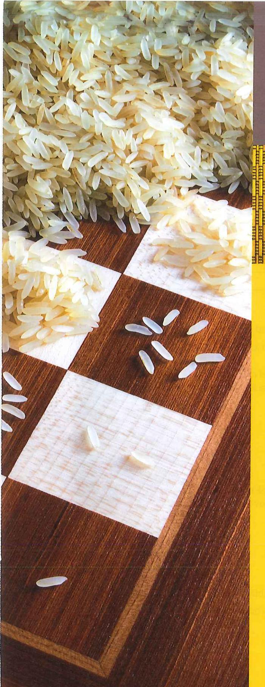

Tänk dig att du räknar från talet ett och att du räknar ett nytt heltal varje sekund.

- Hur lång tid tar det att räkna till en miljon?
   Behöver du räkna i några dagar, några veckor eller några månader?
- Har du levt i en miljard sekunder?

Det finns en klassisk historia som har berättats sedan 1200-talet.

Den rika Indiska konungen Shirma hade fruktansvärt tråkigt om dagarna och lät utlysa en tävling. Den som kunde komma på något som verkligen intresserade honom skulle få en belöning.

En dag kom Sissa ben Dahir till konungen med ett schackspel. Kungen blev förtjust i spelet och ville belöna Sissa. Sissa pekade på schackbrädet och förklarade att han skulle bli nöjd om han blev belönad med ett riskorn på första rutan, två riskorn på andra rutan, fyra på den tredje, åtta på den fjärde och så vidare till den sista rutan. Antalet riskorn skulle alltså fördubblas på varje efterföljande ruta. Konungen gick med på den blygsamma önskan.

- Hur många rutor fanns det på brädet?
- Hur många riskorn skulle det finnas på den åttonde rutan?
- Hur många riskorn skulle det finnas på den 16:e rutan?
- Gissa hur mycket ris det skulle ha funnits på brädet om kungen haft möjlighet att uppfylla mannens önskan.

## Stora tal

En miljonär är en person som äger minst en miljon kronor. En miljardär är en person som äger minst en miljard kronor. Hur många gånger större är en miljard jämfört med en miljon?

I tabellen ser du att en miljard är tusen gånger större än en miljon.

| Tal               | Namn    |
|-------------------|---------|
| 100               | hundra  |
| 1 000             | tusen   |
| 1 000 000         | miljon  |
| 1 000 000 000     | miljard |
| 1 000 000 000 000 | biljon  |

Genom att göra ett litet mellanrum mellan var tredje nolla blir det mycket lättare att se hur stort talet är.

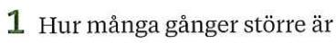

- a) en miljon än ett tusen
- b) en miljard än ett tusen
- c) en biljon än en miljard
- d) en biljon än en miljon

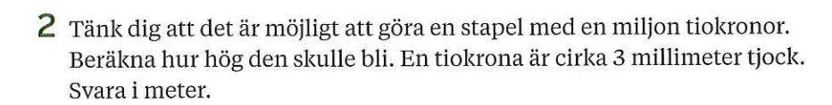

- 3 Skriv talen med siffror.
  - a) Tre miljarder fyrahundrafem miljoner.
  - b) En biljon nio miljarder trettiofemtusen.
- **4** I USA har man annorlunda benämningar på några av de stora talen, något som ibland kan ge upphov till missförstånd.

| Sverige | USA      |
|---------|----------|
| miljon  | million  |
| miljard | billion  |
| biljon  | trillion |

- a) Hur många billions (am.) går det på en biljon (sv.)?
- b) Hur många millions (am.) går det på en biljon (sv.)?

# Prefix för stora tal

När man ska skriva stora tal så kan man ha användning av **prefix**. Prefix är ord som sätts framför en enhet, till exempel:

2 **hekto**gram godis = 200 gram godis eftersom hekto betyder hundra.

5 **kilo**gram potatis = 5 000 gram potatis eftersom kilo betyder tusen.

I tabellen ser du prefixen från hundra till biljon.

| Tal               | Namn    | Prefix | Förkortning |
|-------------------|---------|--------|-------------|
| 100               | hundra  | hekto  | h           |
| 1 000             | tusen   | kilo   | k           |
| 1 000 000         | miljon  | mega   | М           |
| 1 000 000 000     | miljard | giga   | G           |
| 1 000 000 000 000 | biljon  | tera   | Т           |

#### $\rightarrow$ Exempel

a) Skriv 8 GB utan prefix.

b) Skriv 1,5 TB utan prefix.

#### Svar:

- a) 8 GB = 8 miljarder bytes = 8 000 000 000 bytes
- b) 1,5 TB = 1,5 biljon bytes = 1 500 000 000 000 bytes

- **5** a) En låt i mp3-format kan uppta lagringsutrymmet 3 MB. Skriv 3 MB utan prefix.
  - b) Ett usb-minne har lagringsutrymmet 64 GB. Skriv 64 GB utan prefix.
- 6 Hur många watt (W) är
  - a) 200 kW
- b) 14 MW
- c) 160 TW

- 7 Hur många kronor är
  - a) 13 kkr
- b) 4,5 Mkr
- c) 1,4 Gkr

- 8 Hur många gånger mer är
  - a) 1 MB jämfört med 1 kB
- b) 1 GB jämfört med 1 MB
- c) 1 TB jämfört med 1 GB
- d) 1 TB jämfört med 1 kB
- **9** Skriv med lämpligt prefix.
  - a) 400 g
- **b)** 5 000 g
- c) 1 500 000 Hz
- d) 56 000 000 000 000 Wh

# **Tiopotenser**

När man mäter avstånd i rymden använder man sig av ett längdmått som heter ljusår. Det är den sträcka som ljuset färdas på ett år. Ett ljusår är nästan 10 000 000 000 000 km. För att skriva så stora tal kan man använda sig av potenser. **Potenser** är ett sätt att skriva upprepad multiplikation.

$$10\ 000\ 000\ 000\ 000\ = 10 \cdot 10 \cdot 10 \cdot 10 \cdot 10 \cdot 10 \cdot 10 \cdot 10$$

Talet 10 har multiplicerats med sig själv 13 gånger.

Talet  $10^{13}$  är skrivet i potensform med basen 10. Man brukar också säga att talet är skrivet som en **tiopotens** och det uttalas tio upphöjt till tretton.

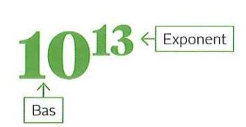

| Tal               | Namn    | Tiopotens        |
|-------------------|---------|------------------|
| 10                | tio     | 10 1  |
| 100               | hundra  | 10 2  |
| 1 000             | tusen   | 10 3  |
| 1 000 000         | miljon  | 10 6  |
| 1 000 000 000     | miljard | 10 9  |
| 1 000 000 000 000 | biljon  | 10 12 |

- **10** Skriv produkterna som en tiopotens.
  - a) 10·10
- b)  $10 \cdot 10 \cdot 10 \cdot 10 \cdot 10 \cdot 10$
- c) 10 · 10 · 10 · 10 · 10 · 10 · 10
- 11 Skriv talen på vanligt sätt utan potens.
  - a) 104
- **b)** 105
- c)  $10^7$
- d) 109
- 12 Skriv talen som en tiopotens
  - a) 100
- b) 10 000
- c) 100 000
- d) 10 000 000
- **13** Skriv talen först med siffror på vanligt sätt och sedan som en tiopotens.
  - a) hundratusen
- b) tiotusen
- c) 10 miljoner
- d) 100 miljarder

- 14 Vad ska stå i stället för A–F i tabellen?
- **15** Hur många watt motsvarar följande? Skriv som en tiopotens.
  - a) 1 GW
- **b)** 10 kW
- c) 10 TW

| Tal           | Tiopotens | Prefix |  |
|---------------|-----------|--------|--|
| 1 000         | А         | kilo   |  |
| В             | 106       | С      |  |
| 1 000 000 000 | D         | giga   |  |
| E             | 1012      | F      |  |

# Stora tal i grundpotensform

Avståndet till månen är ungefär 380 000 000 meter. Det är ett stort tal som på ett enklare sätt kan skrivas med hjälp av tiopotenser:

380 000 000 m = 3,8 
$$\cdot$$
 100 000 000 m = 3,8  $\cdot$  108 m

Talet framför tiopotensen är ett tal mellan 1 och 10.

Här har vi skrivit avståndet i **grundpotensform**. Ett tal skrivet i grundpotensform är skrivet som en produkt av ett tal mellan 1 och 10 och en tiopotens.

## Exempel

Skriv talen i grundpotensform.

- a) 3 500 000
- b) 37 500 000
- $3\ 500\ 000 = 3,5 \cdot 10^6$

$$37\ 500\ 000 = 3,75 \cdot 10^7$$

Storleksordning miljoner

Storleksordning tiotals miljoner

- 16 I rutan finns det några tal.
  - a) Skriv de tal som är skrivna i grundpotensform.
  - b) Skriv de övriga talen så att de är skrivna i grundpotensform.
- $4 \cdot 10^5$   $42 \cdot 10^5$   $5 \cdot 10^4$   $0.5 \cdot 10^4$

- 17 Skriv talen på vanligt sätt.
  - a)  $8 \cdot 10^3$
- b)  $7 \cdot 10^5$
- c)  $9.8 \cdot 10^4$
- d)  $8,25 \cdot 10^6$

- 18 Vilket tal ska stå i stället för x?
  - a)  $4\,500 = 4.5 \cdot 10^x$
- b)  $2950000 = 2,95 \cdot 10^{x}$
- c)  $257\ 000 = x \cdot 10^5$
- d) 42 000 000 =  $x \cdot 10^7$
- 19 Skriv talen i grundpotensform.
  - a) 50 000
- b) 59 000
- c) 50 000 000
- d) 52 900 000

- 20 Kombinera. Välj bland alternativen.
  - (A) trettio tusen
- B femhundra tusen
- © 5 miljoner
- (D) 30 miljoner
- $5 \cdot 10^5 \quad 3 \cdot 10^9 \quad 3 \cdot 10^4$  $5 \cdot 10^6 \quad 3 \cdot 10^7$
- **21** Skriv talen i storleksordning. Börja med det minsta talet.

 $7 \cdot 10^5$  3,5 · 108 4 · 102 2 · 109

# Räkna med tiopotenser

#### Multiplikaton av tiopotenser

100 · 1 000 = 100 000

$$10^2 \cdot 10^3 = 10 \cdot 10 \cdot 10 \cdot 10 \cdot 10 = 10^5$$

$$10^2 \cdot 10^3 = 10^{(2+3)} = 10^5$$

När man multiplicerar potenser med samma bas, adderas exponenterna.

Jämför de båda beräkningarna:

$$\frac{10^3}{10^3} = \frac{1\ 000}{1\ 000} = 1$$

$$\frac{10^3}{10^3} = 10^{3-3} = 10^0 = 1$$

Division av tiopotenser

$$\frac{10^5}{10^3} = \frac{100\ 000}{1\ 000} = 100 = 10^2$$

$$\frac{10^5}{10^3} = 10^{(5-3)} = 10^2$$

När man dividerar potenser med samma bas, subtraheras exponenterna.

$$10^x \cdot 10^y = 10^{(x+y)}$$

$$\frac{10^{x}}{10^{y}} = 10^{(x-y)}$$

$$10^{\circ} = 1$$

Beräkna och svara med en tiopotens.

22 a) 
$$10^3 \cdot 10^4$$

**b)** 
$$10^5 \cdot 10^3$$

c) 
$$10^6 \cdot 10^2 \cdot 10^4$$

d) 
$$10^7 \cdot 10^5 \cdot 10$$

23 Vad ska stå i stället för x?

a) 
$$10^x \cdot 10^4 = 10^9$$

**b)** 
$$10^2 \cdot 10^x = 10^8$$

c) 
$$10^4 \cdot 10^x = 10^{12}$$

d) 
$$10^6 \cdot 10^x = 10^6$$

24 Beräkna och svara med en tiopotens.

a) 
$$\frac{10^4}{10^2}$$

b) 
$$\frac{10^7}{10^3}$$

c) 
$$\frac{10^9}{10^3}$$

d) 
$$\frac{10^4}{10}$$

25 Vad ska stå i stället för x?

a) 
$$\frac{10^6}{10^x} = 10^2$$
 b)  $\frac{10^5}{10^x} = 10^4$ 

b) 
$$\frac{10^5}{10^x} = 10^4$$

c) 
$$\frac{10^3}{10^3} = 10^x$$

d) 
$$\frac{10^{x}}{10^{4}} = 10^{0}$$

26 År 2018 fanns i Sverige några personer med en förmögenhet på 100 miljarder kronor eller mer. Tänk dig att en av dem delade upp sina pengar jämt mellan Sveriges befolkning. Hur mycket skulle var och en få? Räkna med en befolkning på 10 miljoner människor.

27 Hur många gånger större är

a) 
$$10^6 \, \text{an} \, 10^5$$

28 Adrian och Yasmine ska beräkna 103 + 104. Adrian säger att det är lika med  $10^7$  och Yasmine säger att det är lika med 11 000 =  $1.1 \cdot 10^4$ . Förklara varför Yasmine har rätt.

29 Beräkna. Svara på vanligt sätt utan tiopotens.

a) 
$$10^2 + 10^4$$

b) 
$$10^3 + 10^2 + 10^0$$
 c)  $10^5 - 10^4$ 

c) 
$$10^5 - 10^4$$

# Räkna med tal i grundpotensform

#### Exempel

Beräkna och svara i grundpotensform.

Addera exponenterna.

a)  $3 \cdot 10^6 \cdot 1.5 \cdot 10^2 = 3 \cdot 1.5 \cdot 10^6 \cdot 10^2 = 4.5 \cdot 10^{6+2} = 4.5 \cdot 10^8$ Multiplicera talen

Talet framför tiopotensen ska

framför tiopotenserna.

vara ett tal mellan 1 och 10.

b)  $\frac{7.2 \cdot 10^9}{8 \cdot 10^3} = \frac{7.2}{8} \cdot 10^{9-3} = 0.9 \cdot 10^6 = 0.9 \cdot 10 \cdot 10^5 = 9 \cdot 10^5$ 

Dividera talen framför Subtrahera tiopotenserna. exponenterna Det här programmet i pythonkod beräknar värdet av potensen i uppgift a. print(3 \* 10\*\*6 \* 1.5 \* 10\*\*2)

450000000.0

## **30** Skriv i grundpotensform.

- a)  $50 \cdot 10^3$
- b)  $0.5 \cdot 10^3$
- c)  $529 \cdot 10^3$
- d)  $0.59 \cdot 10^3$

Beräkna och svara i grundpotensform.

- **31** a)  $2 \cdot 10^3 \cdot 4 \cdot 10^2$
- b)  $1.2 \cdot 10^3 \cdot 3 \cdot 10^6$
- c)  $2 \cdot 10^4 \cdot 4.5 \cdot 10^3$

- 32 a)  $5 \cdot 10^3 \cdot 4 \cdot 10^2$
- b)  $8 \cdot 10^5 \cdot 2 \cdot 10^4$
- c)  $4 \cdot 10^9 \cdot 3 \cdot 10^2$
- **33** a)  $\frac{6 \cdot 10^8}{2 \cdot 10^3}$  b)  $\frac{8 \cdot 10^6}{4 \cdot 10^2}$

- **34** a)  $\frac{2.5 \cdot 10^9}{5 \cdot 10^6}$
- b)  $\frac{4.8 \cdot 10^7}{6 \cdot 10^3}$
- c)  $\frac{1.4 \cdot 10^7}{2 \cdot 10^4}$

#### 35 Vilket tal ska stå i stället för x?

a) 
$$2 \cdot 10^5 \cdot x = 8 \cdot 10^7$$

b) 
$$2 \cdot 10^6 \cdot x = 9 \cdot 10^9$$

c) 
$$\frac{7 \cdot 10^6}{r} = 3.5 \cdot 10^3$$

$$2 \cdot 10^4 \cdot 3 \cdot 10^2 = 6 \cdot 10^6$$
  
 $2 \cdot 10^4 + 3 \cdot 10^2 = 2,03 \cdot 10^4$ 

Beräkna

37 a) 
$$3 \cdot 10^6 + 2 \cdot 10^6$$

b) 
$$3 \cdot 10^6 + 2 \cdot 10^5$$
 c)  $3 \cdot 10^6 + 2 \cdot 10^4$ 

c) 
$$3 \cdot 10^6 + 2 \cdot 10^6$$

d) 
$$3 \cdot 10^6 + 2 \cdot 10^3$$

38 a) 
$$5 \cdot 10^6 - 2 \cdot 10^6$$

b) 
$$5 \cdot 10^6 - 2 \cdot 10^6$$

c) 
$$5 \cdot 10^6 - 2 \cdot 10$$

b) 
$$5 \cdot 10^6 - 2 \cdot 10^5$$
 c)  $5 \cdot 10^6 - 2 \cdot 10^4$  d)  $5 \cdot 10^6 - 2 \cdot 10^3$ 

#### **39** Lös uppgift 37 och 38 med programmering. Använd pythonprogrammet i rutan.

# Små tal i grundpotensform och med prefix

Storleken på en mänsklig cell är ungefär en miljondels meter, 0,000 001 m. Mycket små tal kan skrivas enklare med tiopotens eller prefix.

Om vi använder räknelagarna för att dividera med tal i potensform så ser vi att

$$\frac{1}{1\ 000\ 000} = \frac{10^0}{10^6} = 10^{0-6} = 10^{-6}$$

Det betyder att en miljondel =  $\frac{1}{1000000}$  =  $10^{-6}$ 

En miljondels meter kan skrivas med prefix som en mikrometer,  $1 \mu m = 10^{-6} m$ .

| Tal i bråkform         | Tal i decimalform | Tiopotens        | Prefix    | Tal med ord |
|------------------------|-------------------|------------------|-----------|-------------|
| $\frac{1}{10}$         | 0,1               | 10-1             | deci (d)  | tiondel     |
| $\frac{1}{100}$        | 0,01              | 10-2             | centi (c) | hundradel   |
| $\frac{1}{1000}$       | 0,001             | 10-3             | milli (m) | tusendel    |
| $\frac{1}{1000000}$    | 0,000 001         | 10-6             | mikro (μ) | miljondel   |
| $\frac{1}{1000000000}$ | 0,000 000 001     | 10 -9 | nano (n)  | miljarddel  |

Längden på en bakterie kan vara 0,000 06 m. Skriv längden i grundpotensform.

 $0,000\ 06\ m = 6 \cdot 0,000\ 01\ m = 6 \cdot 10^{-5}\ m$ 

**40** Skriv på vanligt sätt. Välj ur rutan.

a) 
$$3 \cdot 10^{-2}$$

b) 
$$3 \cdot 10^{-4}$$

c) 
$$5 \cdot 10^{-3}$$

d) 
$$5 \cdot 10^{-2}$$

**41** Skriv i grundpotensform. Välj ur rutan.

$$2 \cdot 10^{-4}$$
  $4 \cdot 10^{-2}$   $4 \cdot 10^{-3}$   $2 \cdot 10^{-1}$ 

42 Välj rätt tal i rutan till varje uttryck.

$$3 \cdot 10^{-5}$$
  $3 \cdot 10^{-6}$   $3 \cdot 10^{-9}$ 

Skriv i grundpotensform.

- 43 a) 0,1
- **b)** 0,001
- c) 0,000 000 1
- d) 0,000 000 001

- **44** a) 0,02
- b) 0,004
- c) 0,000 09
- d) 0,000 005

Skriv på vanligt sätt.

- **45** a) 10-3
- b) 10-4
- c) 10-5
- d) 10-6

- **46** a) 9·10-1
- b) 4·10-2
- c)  $5 \cdot 10^{-3}$
- d) 8·10-4

- 47 a)  $7 \cdot 10^{-3}$
- b)  $7.5 \cdot 10^{-3}$
- c)  $7,25 \cdot 10^{-3}$
- d) 7,25 · 10-4
- 48 Vilka av talen i rutan är skrivna i grundpotensform? Motivera ditt svar.

$$12 \cdot 10^{-5}$$
  $0.7 \cdot 10^{-6}$   $7 \cdot 10^{-2}$   $3.5 \cdot 10^{-5}$ 

- 49 Använd tabellen på förra sidan. Vilket prefix betyder detsamma som
  - a) en tusendel
- b) 0,1
- c)  $\frac{1}{100}$

- d) en miljondel
- e) 10-9
- f) 10-3
- **50** Vilket eller vilka uttryck i rutan är detsamma som
- 4 · 10-3 m 4 · 10-6 m 0,000 004 m 0,000 000 004 m

- a) 4 millimeter
- b) 4 mikrometer
- **51** Skriv som meter i grundpotensform.
  - a) 9 centimeter
- b) 9 millimeter
- c) 9 mikrometer
- d) 95 mikrometer
- **52** a) Synligt ljus har en våglängd som ligger mellan cirka 400 nm och 700 nm. Skriv våglängderna i grundpotensform med enheten meter.
  - b) Ögat har sin högsta ljuskänslighet vid våglängden 550 nm. Skriv våglängden i grundpotensform med enheten meter.
- $53\,$  De vågor som vi använder oss av när vi värmer mat i en mikrovågsugn har en våglängd på ungefär 1 dm. Hur många mikrometer är en decimeter?
- **54** Skriv uttrycken i storleksordning. Börja med det minsta.

45 mg 
$$5 \cdot 10^{-2}$$
 g  $\frac{3}{10}$  g 500 µg

# Tal i potensform

Upprepad multiplikation kan enkelt skrivas i potensform.

Till exempel kan  $5 \cdot 5 \cdot 5$  skrivas  $5^3$ .

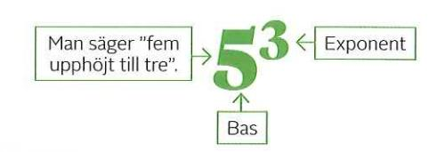

## Exempel

Beräkna 28 med

- a) räknare
- b) utan räknare

#### Svar:

b) 
$$2^8 = 2 \cdot 2 \cdot 2 \cdot 2 \cdot 2 \cdot 2 \cdot 2 \cdot 2 = 256$$

Det här programmet i pythonkod beräknar värdet av en potens med hjälp av en for-loop.

bas = int(input("Skriv potensens bas:")) exponent = int(input("Skriv potensens exponent:")) for x in range(0, exponent):

potens = potens \* bas print("Potensens värde är:", potens)

Skriv potensens bas: 5 Skriv potensens exponent: 3

Skriv i potensform.

- 55 a) fem upphöjt till fyra
- b) två upphöjt till tre
- c) 10 upphöjt till två

- **56** a) 3·3·3·3
- b) 4·4
- c)  $(-2) \cdot (-2) \cdot (-2)$
- d)  $x \cdot x \cdot x$

- **57** Skriv det tal i potensform där
  - a) basen är sju och exponenten är tre
- b) basen är fem och exponenten är fyra

Beräkna

- 58 a) 32
- b) 34
- c)  $4^3$
- d) 19
- e)  $10^3$

- **59** a) 0,32
- b)  $0.2^3$
- c)  $1.5^2$
- d)  $0.1^3$
- $e) 0.7^2$
- 60 Lös uppgift 58 och 59 med hjälp av pythonprogrammet i rutan.
- **61** Beräkna utan räknare. Vilket tal är störst?
  - a)  $3^2$  eller  $2 \cdot 3$
- b) 23 eller 32
- c) 34 eller 92
- d) 1 · 6 eller 16

- e)  $0.5^2$  eller  $2 \cdot 0.5$
- f)  $(-3)^2$  eller  $2 \cdot (-3)$  g) 3 eller  $3^1$
- h)  $(-1)^3$  eller  $(-1)^2$

- **62** a)  $2^{13} = 8192$ . Vad är  $2^{14}$ ?
- **b)**  $3^6 = 729$ . Vad är  $3^8$ ?
- c)  $5^7 = 78125$ . Vad är  $5^6$ ?

- **63** Skriv i potensform
  - a) talet 25 med basen 5
- b) talet 64 med basen 4
- c) talet 32 med basen 2
- d) talet 400 med basen 20

# Räkna med tal i potensform

På samma sätt som man räknar med tiopotenser räknar man med andra tal i potensform.

$$2^3 \cdot 2^4 = (2 \cdot 2 \cdot 2) \cdot (2 \cdot 2 \cdot 2 \cdot 2) = 2^7$$

$$2^3 \cdot 2^4 = 2^{3+4} = 2^7$$
 När man multiplicerar potenser med samma bas, adderas exponenterna

$$\frac{2^7}{2^3} = 2^{7-3} = 2^4$$

 $\frac{2^7}{2^3}$  =  $2^{7-3}$  =  $2^4$  När man dividerar potenser med samma bas, subtraheras exponenterna.

Jämför de båda beräkningarna

$$\frac{2^3}{2^3} = \frac{8}{8} = 1$$

$$\frac{2^3}{2^3} = 2^{3-3} = 2^0 = 1$$

 $\frac{2^3}{2^3} = 2^{3-3} = 2^0 = 1$ Ett tal upphöjt till noll är alltid lika med 1.

$$a^{x} \cdot a^{y} = a^{x+y}$$

$$\frac{a^{x}}{a^{y}} = a^{x-y}$$

$$a^{0} = 1$$

Beräkna och svara med en potens.

c) 
$$x^3 \cdot x^5$$

d) 
$$a \cdot a^4$$

**65** a) 
$$\frac{10^3}{10^2}$$

b) 
$$\frac{2^5}{2^3}$$

c) 
$$\frac{4^3}{4^3}$$

c) 
$$\frac{4^3}{4^3}$$
 d)  $\frac{5^2 \cdot 5^4}{5^3}$ 

**66** a) 
$$\frac{3 \cdot 3^4}{3^2}$$

b) 
$$\frac{a \cdot a^4}{a^2}$$

c) 
$$\frac{4^2 \cdot 4^4}{4}$$

d) 
$$\frac{x^2 \cdot x^4}{x}$$

**67** Vilket tal ska stå i stället för *x*?

a) 
$$10^3 \cdot 10^x = 10^8$$
 b)  $2^x \cdot 2^6 = 2^9$ 

b) 
$$2^x \cdot 2^6 = 2^9$$

c) 
$$3^2 \cdot 3 \cdot 3^x = 3^7$$
 d)  $2^3 \cdot 2^x = 4^3$ 

d) 
$$2^3 \cdot 2^x = 4^3$$

Beräkna

**68** a) 
$$10^4 \cdot 10^3$$

b) 
$$\frac{10^6}{10^4}$$

c) 
$$2^5 \cdot 5^2$$
 d)  $\frac{3^4}{4^2}$ 

d) 
$$\frac{3^4}{4^2}$$

**69** a) 
$$10^4 + 10^3$$

b) 
$$10^6 - 10^4$$

c) 
$$2^5 + 5^2$$

d) 
$$3^4 - 4^2$$

När man adderar och subtraherar tal i potensform räknar man på vanligt sätt genom att först beräkna varje potens. Det gäller även när man multiplicerar och dividerar potenser med olika baser.

**70** Vilket eller vilka uttryck betyder samma som uttrycket  $4^4 + 4^4 + 4^4 + 4^4$ ?

71 Visa att.

a) 
$$2^{10} = 4^{10}$$

b) 
$$3^4 = 9^2$$

a) 
$$2^{10} = 4^5$$
 b)  $3^4 = 9^2$  c)  $16^7 = 4^{14}$ 

# Tal i kvadrat

Talet 9 är ett **kvadrattal** eftersom det kan skrivas som ett heltal multiplicerat med sig självt.

Talet 9 kan skrivas  $3 \cdot 3 = 3^2$ 

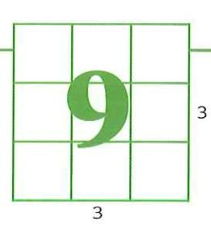

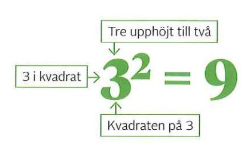

Beräkna **72** a) 42

- **b)** 82
- c) 122
- d) 252

- **73** a) "5 i kvadrat"
- b) "kvadraten på 50"

Kvadrattal  $1^2 = 1 \cdot 1 = 1$   $2^2 = 2 \cdot 2 = 4$   $3^2 = 3 \cdot 3 = 9$  $4^2 =$ osv.

- **74** Gör en tabell där du skriver alla kvadrattal som är mindre än eller lika med 400.
- **75** Alla kvadrattal kan skrivas som summan av talet 1 och ett eller flera av de följande udda talen.

$$1 + 3 = 4 = 2^2$$

$$1 + 3 + 5 = 9 = 3^2$$

- a) Lägg till nästa udda tal. Beräkna summan. Är summan ett kvadrattal?
- b) Gör på samma sätt tills du har beräknat de 10 första kvadrattalen.
- c) Förklara hur det kommer sig att du får nästa kvadrattal genom att addera nästa udda tal. Använd gärna figuren till höger.

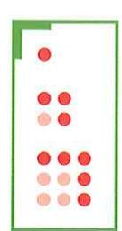

Beräkna. Ta gärna hjälp av din tabell från uppgift 74 och mönstret i rutan.

- 76 a) 0,22
- b) 0,42
- c)  $0.02^2$
- d)  $0.04^2$

- 77 a) 0.52
- **b)** 0,92
- c)  $0.05^2$
- d) 0,092

- 78 a) 1,12
- b)  $1,5^2$
- c)  $0,11^2$
- d)  $0,15^2$

- 79 a) (-2)2
- b)  $(-3)^2$
- c)  $(-0.5)^2$
- d) (-12)2

Bestäm vilka värden på x som gör att likheten stämmer. Varje x kan här ha två värden.

80 a) 
$$x^2 = 4$$

b) 
$$x^2 = 9$$

c) 
$$x^2 = 25$$

d) 
$$x^2 = 100$$

Ser du mönstret?

 $12^2 = 12 \cdot 12 = 144$ 

 $1,2^2 = 1,2 \cdot 1,2 = 1,44$  $0,12^2 = 0,12 \cdot 0,12 = 0,0144$ 

**81** a) 
$$x^2 = 0.04$$

b) 
$$x^2 = 0.25$$

c) 
$$x^2 = 0.36$$

d) 
$$x^2 = 0.64$$

## **Kvadratrot**

Hur lång är kvadratens sida?

För att beräkna vilket tal som multiplicerat med sig självt blir 9, beräknar man

kvadratroten ur 9.

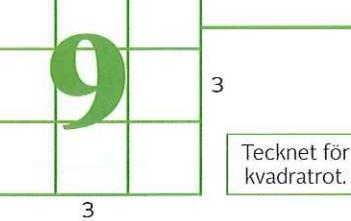

Tecknet för kvadratrot.  $\rightarrow \sqrt{9} = 3$ 

Så här skriver man kvadratroten ur 9.

Det är endast vissa kvadratrötter som kan anges som ett exakt tal.

## > Exempel

Sätt ut talen på tallinjen.

- a) √16
- **b)** √25
- **c)** √20

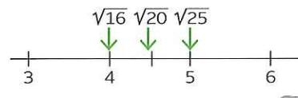

#### Svar:

a)  $\sqrt{16} = 4 \text{ eftersom } 4 \cdot 4 = 16$ 

**b)**  $\sqrt{25} = 5$  eftersom  $5 \cdot 5 = 25$ 

c)  $\sqrt{20}$  går inte att ange som ett heltal eftersom 20 inte kan skrivas som ett heltal i kvadrat. Med en räknare kan man ange ett ungefärligt värde på  $\sqrt{20} \approx 4,47$ .

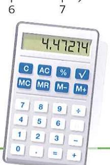

Beräkna utan att använda räknare.

- **82** a) √4
- **b)** √36
- c)  $\sqrt{100}$
- d) √49

- **83** a) √0,04
- **b)** √0,09
- c)  $\sqrt{0.25}$
- d)  $\sqrt{0.01}$

**84** Rita av tallinjen i genomgångsrutan och markera ungefär var talen till höger ska placeras.

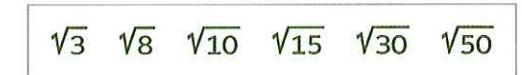

- 85 Mellan vilka heltal ligger talen
  - a) √12
- **b)** √40
- c)  $\sqrt{60}$
- d) √120
- e) √150
- f)  $\sqrt{500}$
- **86** Beräkna kvadratens sida. Använd en räknare och avrunda till två decimaler. Kontrollera genom att mäta sidan.

a)

7,85 cm2

b)

4,52 cm2

c)

3,48 cm2

# **Talmängder**

Det talsystem som vi vanligtvis använder kallas för tiosystemet och har tio siffror. Med dessa siffror kan vi skriva oändligt många tal.

Talen 0, 1, 2, 3, 4, 5, är exempel på naturliga tal. Naturliga tal är alla positiva heltal och talet 0.

Talen -4, -3, -2, -1, 0, 1, 2, 3 är exempel på **hela tal**. Hela tal är alla negativa heltal, alla positiva heltal och talet noll.

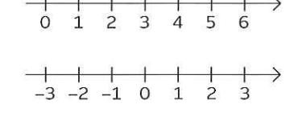

Talen – 2,5, –0,9,  $\frac{1}{2}$ ,  $\frac{69}{100}$ , 3,75 är exempel på **rationella** tal. Rationella tal är de tal som kan skrivas som ett bråk.

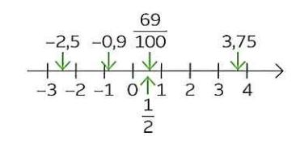

De tal som inte kan skrivas som ett bråk kallas för **irrationella tal**. Exempel på irrationella tal är  $\pi$ ,  $\sqrt{2}$ ,  $-\sqrt{3}$ .

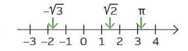

De rationella talen och de irrationella talen är tillsammans de reella talen. Varje punkt på tallinjen motsvarar ett reellt tal.

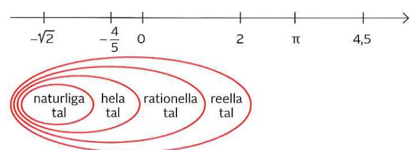

87 Svara sant eller falskt på följande påståenden:

- a) (-4,8) är ett heltal
- b) (-5) är ett naturligt tal
- c)  $\frac{1}{99}$  är ett rationellt tal d) 3,25 är ett rationellt tal
- e)  $\pi$  är ett rationellt tal
- f) π är ett reellt tal

**88** Rita av tallinjen och markera ungefär var talen ska placeras.

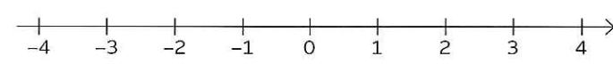

- (A) = 3

- 89 I rutan finns det olika tal. Några tal kan tillhöra flera talmängder. Vilket eller vilka av talen i rutan är
- 0.9 8 (-1.45)  $\pi$

- a) naturliga tal
- b) hela tal
- c) rationella tal
- d) irrationella tal
- e) reella tal

- 90 Skriv ett tal som är
  - a) ett rationellt tal men inte ett heltal
  - b) ett heltal men inte ett naturligt tal
- 91 Avgör om följande påståenden alltid är sanna, alltid falska, eller kan vara både sanna och falska. Rita av tabellen och kryssa i ditt svar.
  - a) Ett naturligt tal är ett heltal.
  - b) Ett heltal är ett naturligt tal.
  - c) Ett negativt tal är ett naturligt tal.
  - d) Ett rationellt tal är ett naturligt tal.
  - e) Ett rationellt tal är ett reellt tal.
  - f) Ett irrationellt tal är ett reellt tal.
- 92 John säger att 0,454 är ett rationellt tal och kan skrivas som en kvot mellan två hela tal. Visa att han har rätt.

|   | Sant | Kan vara både sant och falskt | Falskt |
|---|------|----------------------------------|--------|
| a |      |                                  |        |
| b |      |                                  |        |
| С |      |                                  |        |
| d |      |                                  |        |
| е |      |                                  |        |
| f |      |                                  |        |

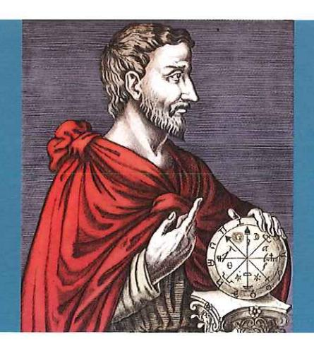

## H Pythagoras

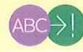

## ABC | Begrepp och resonemang

64 000 000 000 B kan skrivas med prefix som 64 GB

64 000 000 000 B kan skrivas i potensform som 649 B

Benjamin

Clara

64 000 000 000 B kan skrivas i grundpotensform som 64 · 109 B

64 000 000 000 B kan skrivas i grundpotensform som 6,4 · 1010 B

Dilan

#### Resonemang

A Leyla säger att  $3a^2 - 2a = a$ . Förklara varför Leyla har fel.

**B** Beräkna

a) 
$$\frac{10^5 + 10^5}{10^5}$$

a) 
$$\frac{10^5 + 10^5}{10^5}$$
 b)  $\frac{2020 + 2020 + 2020}{2020}$   
c)  $\frac{10^5 \cdot 10^5}{10^5}$  d)  $\frac{2020 \cdot 2020 \cdot 2020}{2020}$ 

c) 
$$\frac{10^5 \cdot 10^5}{10^5}$$

d) 
$$\frac{2020 \cdot 2020 \cdot 2020}{2020}$$

**C** Andrea säger att  $\frac{a+a}{a}$  = 2 och att  $\frac{a \cdot a}{a}$  = a. Förklara varför Andrea har rätt.

**D** Peder säger att  $\frac{b^2 + b^2}{b} = 2b$  och att  $\frac{b^2 \cdot b^2}{b} = b^3$ . Förklara varför Peder också har rätt.

## Begreppskarta

Rita en begreppskarta där du kopplar samman följande begrepp och länkord med varandra.

Begrepp: Stora tal, prefix, tera, giga, mega, kilo, potensform, grundpotensform, bas, exponent, tusen, miljon, miljard, biljon

Länkord: kan skrivas som, betyder, är alltid ett tal mellan 1 och 10, är detsamma som